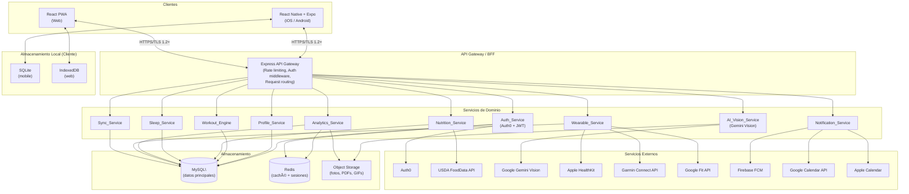
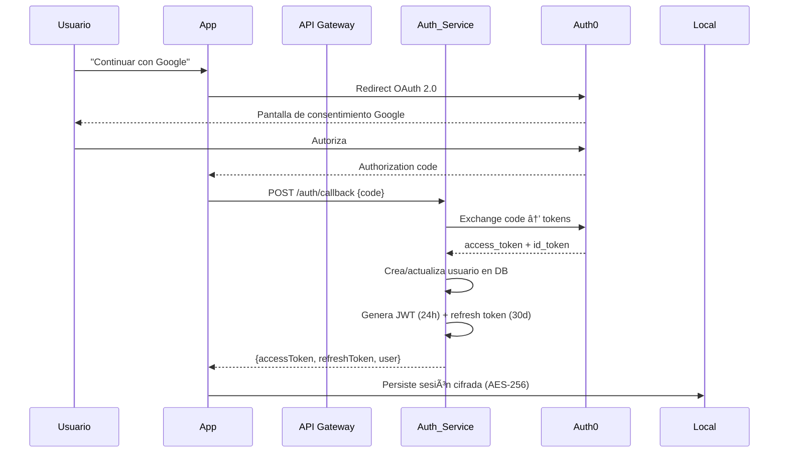

# Documento de Diseño Técnico — GymBit

## Tabla de Contenidos

1. [Visión General](#1-visión-general)
2. [Arquitectura del Sistema](#2-arquitectura-del-sistema)
3. [Componentes e Interfaces](#3-componentes-e-interfaces)
4. [Modelos de Datos](#4-modelos-de-datos)
5. [Propiedades de Corrección](#5-propiedades-de-corrección)
6. [Manejo de Errores](#6-manejo-de-errores)
7. [Estrategia de Testing](#7-estrategia-de-testing)

---

## 1. Visión General

GymBit es una plataforma fitness multiplataforma (iOS, Android, Web PWA) que integra gestión de rutinas, nutrición, sueño, wearables y analíticas en una sola experiencia. El sistema opera en modo online y offline completo, priorizando la privacidad del usuario (GDPR / Ley 1581 de Colombia) y el rendimiento (carga inicial < 3 s en 4G).

### Decisiones técnicas clave

| Decisión | Elección | Justificación |
|---|---|---|
| Frontend móvil | React Native + Expo | Código compartido iOS/Android, acceso a APIs nativas (HealthKit, SQLite, notificaciones), ecosistema maduro |
| Frontend web | React + PWA | Reutilización de lógica de negocio con el móvil, soporte offline via Service Worker + IndexedDB |
| Backend | Node.js + Express | Ecosistema JavaScript unificado con el frontend, alto rendimiento I/O para sincronización en tiempo real |
| Base de datos principal | MySQL | ACID, soporte JSON nativo para datos semiestructurados (logs de wearables), soporte de índices espaciales y funciones geoespaciales para futuras necesidades de geolocalización |
| Autenticación | Auth0 | Gestión de OAuth 2.0 / OIDC delegada, soporte MFA, cumplimiento GDPR out-of-the-box, reduce superficie de ataque |
| IA Nutrición | Google Gemini Vision | Precisión ≥ 85% en reconocimiento de alimentos, API REST simple, sin necesidad de modelo propio |
| Offline storage | SQLite (mobile) / IndexedDB (web) | Estándar de la industria para cada plataforma, soporte nativo en Expo (expo-sqlite) |
| Gráficos | Victory Native / Recharts | Victory Native optimizado para React Native, Recharts para web; API similar reduce curva de aprendizaje |
| Notificaciones | Expo Notifications + Firebase FCM | Expo abstrae las diferencias iOS/Android; FCM para entrega confiable en background |

---

## 2. Arquitectura del Sistema

### 2.1 Diagrama de capas



### 2.2 Diagrama de flujo offline/sync

```mermaid
sequenceDiagram
    participant App as App (cliente)
    participant Local as SQLite / IndexedDB
    participant Queue as Cola_Offline
    participant Sync as Sync_Service
    participant DB as MySQL

    App->>Local: Escritura local (timestamp)
    Local->>Queue: Encola operación pendiente
    Note over App: Sin conexión

    App-->>Sync: Conexión recuperada
    Sync->>Queue: Lee operaciones pendientes
    loop Por cada operación en cola
        Sync->>DB: Aplica escritura
        DB-->>Sync: Confirma
        alt Conflicto detectado
            Sync->>Sync: Última escritura gana (timestamp)
        end
        Sync->>Queue: Elimina operación procesada
    end
    Sync-->>App: Notifica sincronización completa
```



### 2.3 Flujo de autenticación



---

## 3. Componentes e Interfaces

### 3.1 Auth_Service

**Responsabilidad:** Autenticación, autorización y gestión de sesiones.

```
POST /auth/register          → Registro con correo/contraseña
POST /auth/login             → Login con correo/contraseña
POST /auth/callback          → Callback OAuth 2.0 (Google)
POST /auth/refresh           → Renovar access token
POST /auth/logout            → Invalidar sesión
POST /auth/forgot-password   → Solicitar reset de contraseña
POST /auth/reset-password    → Aplicar nueva contraseña
GET  /auth/verify-email/:token → Verificar correo
```

**Contratos clave:**
- Contraseñas hasheadas con bcrypt (cost factor ≥ 12)
- JWT firmado con RS256, expiración 24 h
- Refresh token rotativo, expiración 30 días, almacenado en DB con hash
- Rate limiting: 5 intentos fallidos → bloqueo 15 min (Redis)
- Sesión offline: JWT + datos de usuario cifrados con AES-256 en almacenamiento local

### 3.2 Profile_Service

**Responsabilidad:** Gestión del perfil físico y cálculo de métricas.

```
GET    /profile              → Obtener perfil completo
PUT    /profile              → Actualizar perfil
POST   /profile/weight       → Registrar nuevo peso
GET    /profile/weight/history → Historial de peso
GET    /profile/metrics      → IMC, TMB, TDEE actuales
```

**Fórmulas implementadas:**

```
IMC = peso_kg / (altura_m)²

TMB (hombre) = 10 × peso_kg + 6.25 × altura_cm − 5 × edad + 5
TMB (mujer)  = 10 × peso_kg + 6.25 × altura_cm − 5 × edad − 161

TDEE = TMB × factor_actividad
  Sedentario:       1.2
  Ligero (1-3d/sem): 1.375
  Moderado (3-5d):  1.55
  Activo (6-7d):    1.725
  Muy activo:       1.9
```

### 3.3 Workout_Engine

**Responsabilidad:** Generación de rutinas, modo entrenamiento en vivo, PRs y sobrecarga progresiva.

```
POST /workouts/generate      → Generar plan de entrenamiento
GET  /workouts/plan          → Plan activo del usuario
GET  /workouts/sessions      → Historial de sesiones
POST /workouts/sessions      → Iniciar sesión
PUT  /workouts/sessions/:id  → Actualizar sesión activa
POST /workouts/sessions/:id/complete → Completar sesión
POST /workouts/series        → Registrar serie
GET  /workouts/prs           → PRs por ejercicio
GET  /exercises              → Catálogo de ejercicios
```

**Lógica de selección de rutina:**

```
días_disponibles = 1-2 → Full Body
días_disponibles = 3   → Full Body o Upper/Lower
días_disponibles = 4-5 → PPL o Upper/Lower
días_disponibles = 6+  → PPL
objetivo = ENDURANCE   → Cardio puro (independiente de días)
nivel = BEGINNER       → Full Body (independiente de días)
```

**Sobrecarga progresiva:**
- Si el usuario completó 100% de series y reps objetivo en la sesión anterior → incremento de 2.5 kg (ejercicios de aislamiento) o 5 kg (ejercicios compuestos)
- El incremento se aplica al inicio de la siguiente sesión

### 3.4 Nutrition_Service

**Responsabilidad:** Registro nutricional, plan nutricional y búsqueda de alimentos.

```
GET  /nutrition/search?q=    → Búsqueda USDA
POST /nutrition/barcode      → Búsqueda por código de barras
POST /nutrition/photo        → Reconocimiento por foto (→ AI_Vision_Service)
GET  /nutrition/daily/:date  → RegistroDiario
POST /nutrition/daily/meals  → Agregar comida al día
POST /nutrition/daily/meals/:id/foods → Agregar alimento a comida
DELETE /nutrition/daily/meals/:id/foods/:foodId → Eliminar alimento
GET  /nutrition/recipes      → Recetas guardadas
POST /nutrition/recipes      → Crear receta
GET  /nutrition/plan         → Plan nutricional activo
POST /nutrition/plan/generate → Generar plan nutricional
```

**Cálculo de objetivos calóricos:**

```
LOSE_WEIGHT:  objetivo_kcal = TDEE − 400 (punto medio 300-500)
GAIN_MUSCLE:  objetivo_kcal = TDEE + 300 (punto medio 200-400)
GAIN_WEIGHT:  objetivo_kcal = TDEE + 300
MAINTENANCE:  objetivo_kcal = TDEE
ENDURANCE:    objetivo_kcal = TDEE
```

**Distribución de macros:**

```
GAIN_MUSCLE:
  proteínas = 1.9 g/kg × peso_kg  (punto medio 1.6-2.2)
  grasas     = 0.25 × objetivo_kcal / 9
  carbos     = (objetivo_kcal − proteínas×4 − grasas×9) / 4

LOSE_WEIGHT:
  proteínas = 1.4 g/kg × peso_kg  (punto medio 1.2-1.6)
  grasas     = 0.25 × objetivo_kcal / 9
  carbos     = (objetivo_kcal − proteínas×4 − grasas×9) / 4
```

### 3.5 Sleep_Service

```
POST /sleep              → Registrar sueño manual
GET  /sleep/history      → Historial de sueño
GET  /sleep/latest       → Último registro de sueño
POST /sleep/wearable     → Importar datos de wearable
```

### 3.6 Analytics_Service

```
GET /analytics/dashboard     → Resumen diario completo
GET /analytics/charts/:type  → Datos para gráfico específico
POST /analytics/export/pdf   → Generar reporte PDF mensual
```

### 3.7 Wearable_Service

```
POST /wearables/connect/:provider    → Conectar wearable
DELETE /wearables/disconnect/:provider → Desconectar
GET  /wearables/status               → Estado de conexiones
POST /wearables/sync                 → Sincronización manual
GET  /wearables/data                 → Datos importados
```

### 3.8 Notification_Service

```
GET  /notifications/settings         → Configuración actual
PUT  /notifications/settings         → Actualizar configuración
POST /notifications/calendar/connect → Conectar calendario
GET  /notifications/history          → Historial de notificaciones
```

### 3.9 Sync_Service

```
POST /sync/push          → Enviar Cola_Offline al servidor
GET  /sync/pull          → Obtener cambios del servidor
GET  /sync/status        → Estado de sincronización
```

---

## 4. Modelos de Datos

### 4.1 Diagrama entidad-relación principal

```mermaid
erDiagram
    USERS {
        uuid id PK
        string email UK
        string auth0_id UK
        string name
        timestamp created_at
        timestamp updated_at
        boolean is_active
        boolean email_verified
    }

    PROFILES {
        uuid id PK
        uuid user_id FK
        date birth_date
        string gender
        decimal height_cm
        decimal weight_kg
        string goal
        string experience_level
        int available_days
        text medical_conditions
        decimal bmi
        decimal bmr
        decimal tdee
        timestamp updated_at
    }

    WEIGHT_HISTORY {
        uuid id PK
        uuid user_id FK
        decimal weight_kg
        timestamp recorded_at
    }

    EXERCISES {
        uuid id PK
        string name
        json muscle_groups
        string equipment_type
        string category
        string gif_url
        string video_url
        boolean is_compound
    }

    WORKOUT_PLANS {
        uuid id PK
        uuid user_id FK
        string plan_type
        boolean is_active
        timestamp generated_at
        json config
    }

    WORKOUT_DAYS {
        uuid id PK
        uuid plan_id FK
        int day_of_week
        string focus
    }

    PLAN_EXERCISES {
        uuid id PK
        uuid day_id FK
        uuid exercise_id FK
        int sets
        int reps_target
        int rest_seconds
        int order_index
        uuid superset_group_id
        decimal weight_kg
    }

    SESSIONS {
        uuid id PK
        uuid user_id FK
        uuid plan_id FK
        timestamp started_at
        timestamp completed_at
        int total_volume_kg
        int duration_seconds
        boolean is_active
        json offline_state
    }

    SERIE_LOGS {
        uuid id PK
        uuid session_id FK
        uuid exercise_id FK
        int set_number
        decimal weight_kg
        int reps_done
        timestamp logged_at
        boolean is_pr
    }

    PERSONAL_RECORDS {
        uuid id PK
        uuid user_id FK
        uuid exercise_id FK
        decimal weight_kg
        int reps
        timestamp achieved_at
    }

    FOODS {
        uuid id PK
        string usda_id UK
        string barcode
        string name
        decimal calories_per_100g
        decimal protein_per_100g
        decimal carbs_per_100g
        decimal fat_per_100g
        string source
    }

    RECIPES {
        uuid id PK
        uuid user_id FK
        string name
        decimal total_calories
        decimal total_protein
        decimal total_carbs
        decimal total_fat
        timestamp created_at
    }

    RECIPE_INGREDIENTS {
        uuid id PK
        uuid recipe_id FK
        uuid food_id FK
        decimal quantity_g
    }

    DAILY_RECORDS {
        uuid id PK
        uuid user_id FK
        date record_date UK
        decimal total_calories
        decimal total_protein
        decimal total_carbs
        decimal total_fat
        int calorie_goal
    }

    MEALS {
        uuid id PK
        uuid daily_record_id FK
        string meal_type
        timestamp logged_at
    }

    FOOD_LOGS {
        uuid id PK
        uuid meal_id FK
        uuid food_id FK
        decimal quantity_g
        decimal calories
        decimal protein
        decimal carbs
        decimal fat
    }

    NUTRITION_PLANS {
        uuid id PK
        uuid user_id FK
        int calorie_goal
        decimal protein_goal_g
        decimal carbs_goal_g
        decimal fat_goal_g
        boolean is_active
        timestamp generated_at
    }

    SLEEP_RECORDS {
        uuid id PK
        uuid user_id FK
        timestamp sleep_start
        timestamp sleep_end
        int duration_minutes
        int quality_stars
        json phases
        string source
        timestamp recorded_at
    }

    WEARABLE_CONNECTIONS {
        uuid id PK
        uuid user_id FK
        string provider
        string access_token_enc
        string refresh_token_enc
        timestamp token_expires_at
        timestamp last_sync_at
        boolean is_active
    }

    WEARABLE_DATA {
        uuid id PK
        uuid user_id FK
        string provider
        date data_date
        int steps
        decimal calories_burned
        int avg_heart_rate
        decimal vo2max
        int stress_level
        json raw_data
    }

    NOTIFICATION_SETTINGS {
        uuid id PK
        uuid user_id FK
        string notification_type
        boolean is_enabled
        time scheduled_time
        json config
    }

    OFFLINE_QUEUE {
        uuid id PK
        uuid user_id FK
        string operation
        string entity_type
        uuid entity_id
        json payload
        timestamp client_timestamp
        boolean is_processed
        timestamp created_at
    }

    USERS ||--|| PROFILES : "tiene"
    USERS ||--o{ WEIGHT_HISTORY : "registra"
    USERS ||--o{ WORKOUT_PLANS : "tiene"
    USERS ||--o{ SESSIONS : "realiza"
    USERS ||--o{ PERSONAL_RECORDS : "logra"
    USERS ||--o{ DAILY_RECORDS : "registra"
    USERS ||--o{ RECIPES : "crea"
    USERS ||--o{ SLEEP_RECORDS : "registra"
    USERS ||--o{ WEARABLE_CONNECTIONS : "conecta"
    USERS ||--o{ WEARABLE_DATA : "importa"
    USERS ||--o{ NOTIFICATION_SETTINGS : "configura"
    USERS ||--o{ OFFLINE_QUEUE : "genera"
    USERS ||--o{ NUTRITION_PLANS : "tiene"

    WORKOUT_PLANS ||--o{ WORKOUT_DAYS : "contiene"
    WORKOUT_DAYS ||--o{ PLAN_EXERCISES : "incluye"
    PLAN_EXERCISES }o--|| EXERCISES : "referencia"

    SESSIONS ||--o{ SERIE_LOGS : "contiene"
    SERIE_LOGS }o--|| EXERCISES : "registra"

    DAILY_RECORDS ||--o{ MEALS : "contiene"
    MEALS ||--o{ FOOD_LOGS : "contiene"
    FOOD_LOGS }o--|| FOODS : "referencia"

    RECIPES ||--o{ RECIPE_INGREDIENTS : "contiene"
    RECIPE_INGREDIENTS }o--|| FOODS : "usa"
```



### 4.2 Estructura de la Cola_Offline

```typescript
interface OfflineQueueItem {
  id: string;                    // UUID local
  userId: string;
  operation: 'CREATE' | 'UPDATE' | 'DELETE';
  entityType: 'session' | 'serie_log' | 'food_log' | 'sleep_record' | 'weight';
  entityId: string;
  payload: Record<string, unknown>;
  clientTimestamp: number;       // Unix ms — usado para "última escritura gana"
  isProcessed: boolean;
}
```

### 4.3 Esquema local SQLite / IndexedDB

El cliente mantiene un subconjunto de las tablas del servidor para operación offline:

| Tabla local | Propósito |
|---|---|
| `users_cache` | Datos de sesión y perfil |
| `workout_plan_cache` | Plan activo + ejercicios |
| `sessions_local` | Sesiones en curso o recientes |
| `serie_logs_local` | Series registradas offline |
| `foods_cache` | Base de datos USDA en caché (~50k alimentos frecuentes) |
| `daily_records_local` | Registros nutricionales del día |
| `food_logs_local` | AlimentoLogs offline |
| `sleep_records_local` | Registros de sueño offline |
| `offline_queue` | Cola de escrituras pendientes |

---


